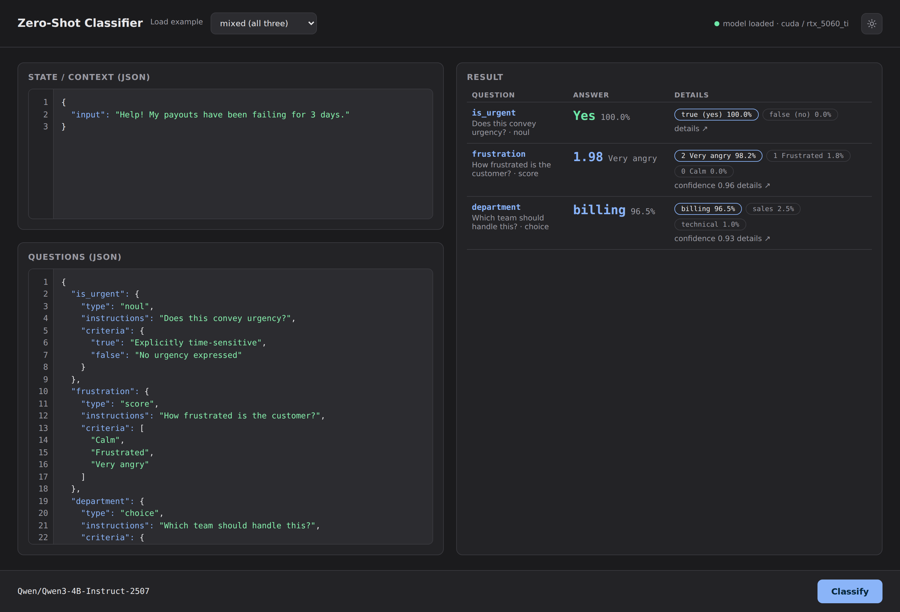

# zero-shot

A local, from-scratch recreation of the [Jev](https://typesafe.ai/) decision
API: a server that turns an arbitrary "state" plus a set of choices into a
decision with real probabilities, no training required.

Read more about the thought process behind it
[here](https://yushenggg.github.io/zero-shot-classifier/).

## Setup

```bash
uv sync
```

## Configuration

Model settings live in `config.toml`:

```toml
model = "Qwen/Qwen3-4B-Instruct-2507"
save_to = "models/qwen3-4b-instruct-2507"   # loaded from disk after first download
device = "auto"                       # auto | cpu | gpu
gpu = "rtx_5060_ti"                   # which GPU when device = "gpu"
quantize = "auto"                     # auto | bf16 | fp32 | int8
kv_cache = true                       # reuse one KV cache for the shared prompt
temperature = 1.0                     # option softmax; >1 less certain, <1 sharper
calibrate = true                      # subtract content-free option priors
calibration_context = "N/A"           # the content-free context used for that
```

Paths in `save_to` are resolved from the project directory. Once populated the
model is loaded with `local_files_only=True` (no network). Overridable with
`$ZERO_SHOT_CONFIG`, `$ZERO_SHOT_MODEL`, `$ZERO_SHOT_SAVE_TO`, `$ZERO_SHOT_DEVICE`,
`$ZERO_SHOT_GPU`, or the CLI flags `--config`, `--model-id`, `--save-to`,
`--device`, `--gpu`.

### KV cache

`kv_cache = true` (default) prefills the shared prompt once and reuses its KV cache
across options (~3-4x faster). Because it uses the cached attention path it is
slightly approximate: rare near-tie tokens can shift, which can occasionally change
a prediction. If a model's cache cannot be reused (no `crop` support, no cache
returned, forward rejects `past_key_values`), the scorer logs a warning and
automatically falls back to the exact path. Use `--no-kv-cache` (CLI/API) to force
exact scoring.

### Calibration

Because the options are compared by their token log-probabilities, the model's
surface-form priors leak in (e.g. `sales` or the digit `1` are simply more likely
tokens, so they win more often). With `calibrate = true` (default) each option is
also scored against a content-free context (`calibration_context`, default `"N/A"`)
and that prior is subtracted before the softmax:

```
score(option) = log P(option | context, cue) − log P(option | "N/A", cue)
```

This removes digital/yes-no/token-length bias; it roughly doubles scoring time
(two passes). Disable with `--no-calibrate` or `calibrate = false`. It does not
correct length-preference between differently long keys.

### Criteria-order bias

For `choice` questions the prompt includes a `# CRITERIA` block listing each key
with its description, so the model sees what each option means before it scores
the key as a continuation. The keys themselves are still scored independently,
so there is no positional bias *between options* — but the order in which the
criteria are listed can still prime the model.

Measured on Qwen3-4B with the payouts example (state: "Help! My payouts have
been failing for 3 days.", `criteria` for `department`):

| option | calibrated logprob, order A (billing, technical, sales) | order B (sales, technical, billing) | Δ |
|---|---|---|---|
| billing  | +1.25 | +3.91 | +2.67 |
| technical | -3.05 | +1.31 | **+4.36** |
| sales    | -12.50 | -14.89 | -2.39 |

Winner is unchanged (`billing`) but `technical` flips sign on its calibrated
score, and `confidence` shifts from 0.97 to 0.87. Take note if you are near the
decision boundary.

## CPU vs GPU

`uv sync` installs the **CUDA** build of PyTorch by default (CUDA 13, supports the
RTX 5060 Ti / Blackwell sm_120). On a machine without a GPU, switch to the CPU-only
build:

```bash
uv pip install --reinstall -r requirements-cpu.txt   # CPU fallback
uv pip install --reinstall -r requirements-gpu.txt   # restore the CUDA build
```

`device = "auto"` uses the GPU when available and falls back to CPU otherwise. Set
`device = "gpu"` to require the GPU (validated against `gpu`, currently
`rtx_5060_ti`), or `device = "cpu"` to force CPU.

### CPU precision (`quantize`)

`quantize = "auto"` uses **bf16** where it is hardware-accelerated — CUDA, or a
CPU advertising `AVX512_BF16`/`AMX_BF16` (e.g. AMD Zen 4/5) — and **fp32**
otherwise. This matters on Intel consumer CPUs since 12th gen (Alder Lake on),
where AVX-512 is fused off: PyTorch then *emulates* bf16, which is several times
slower than fp32 (the SmolLM2 CPU image can take seconds per request there).
`quantize = "fp32"` or `"bf16"` forces a dtype, and `"int8"` applies dynamic
quantization on CPU — faster on AVX2+VNNI and ~4x less RAM, but it perturbs
logprobs, so near-tie predictions can shift. CUDA is never quantized. Overridable
with `--quantize` or `$ZERO_SHOT_QUANTIZE`.

## Usage

```bash
# device comes from config.toml
.venv/bin/zero-shot -q examples/color_question.json -s examples/color_state.json

# choice + noul + score in one call
.venv/bin/zero-shot -q examples/payouts_questions.json -s examples/payouts_state.json

# force the exact (non-KV) path
.venv/bin/zero-shot -q examples/color_question.json -s examples/color_state.json --no-kv-cache

.venv/bin/zero-shot-serve            # web UI at http://127.0.0.1:8000
.venv/bin/zero-shot-serve --cpu-low  # small CPU model (config.smollm.toml)
```

`--cpu-low` serves SmolLM2-360M on CPU from `config.smollm.toml` — handy on a
laptop with no GPU, where the default Qwen3-4B would be slow. The server preloads
the configured model at startup and logs the device, so you can confirm whether it
is running on CPU or GPU.

### HTTP API

`POST /v1/classify/text` (also available at the TypeSafe-compatible
`POST /v1/systemone`) accepts a TypeSafe-style body (all three question types can be
mixed):

```json
{
  "state": { "input": "Help! My payouts have been failing for 3 days." },
  "model": "Qwen/Qwen3-4B-Instruct-2507",
  "questions": {
    "is_urgent": { "type": "noul", "instructions": "Does this convey urgency?" },
    "frustration": { "type": "score", "instructions": "How frustrated is the customer?", "criteria": ["Calm", "Frustrated", "Very angry"] },
    "department": { "type": "choice", "instructions": "Which team should handle this?", "criteria": { "billing": "Payments", "technical": "Bugs", "sales": "Pricing" } }
  }
}
```

Returns `{"model": ..., "answers": { "<id>": <answer> }, "results": [ ... ], "usage":
{"input_tokens": ..., "output_tokens": ...}}`, with answer shapes matching TypeSafe
(`noul`, `choice` + `probabilities` + `confidence`, `score` + `legend` +
`probabilities` + `confidence`).

`model` is optional and defaults to `config.toml`; if a different model is given it
is loaded from (or downloaded into) a sibling directory under `models/`.
`GET /api/health` reports the configured model, device, and `multimodal`
(`true`/`false` once the model is loaded, `null` before) so clients know whether
image input is available.

### Image classification

The same questions can be grounded in an image, using the identical logit
extraction (full-vocabulary `log P(token)` + EOS, corrected softmax) — the image is
just prepended to the prompt through the model's chat template. This needs a
vision-language checkpoint; `config.vlm.toml` points at
`Qwen/Qwen3-VL-4B-Instruct` (~9 GB in bf16). For a reasoning variant, set
`model = "Qwen/Qwen3-VL-4B-Thinking"`.

CLI (`--image`/`-i` takes a file, or `-` for raw bytes on stdin):

```bash
.venv/bin/zero-shot --config config.vlm.toml \
  -q examples/color_question.json -s examples/color_state.json -i photo.jpg
```

HTTP API: `POST /v1/classify/image` accepts `multipart/form-data` with a `file`
image stream and JSON `questions`/`state` strings. Text requests use
`/v1/classify/text`; both go through the exact same scoring path:

```bash
curl -F file=@photo.jpg \
     -F 'questions={"color": {"type": "choice", "instructions": "What color is the fruit?", "criteria": {"red": "", "green": "", "yellow": ""}}}' \
     http://127.0.0.1:8000/v1/classify/image
```

Serve it with `zero-shot-serve --config config.vlm.toml`. In the web UI, switch the
**Text / Image** toggle to Image, attach a file, and Classify — the UI posts to
`/v1/classify/image` (the State editor is hidden, since the image is the context).
The image + prompt are prefilled once and the KV cache is reused across options, so
the calibration pass shares the same image prefill. Passing `--image` to a text-only
model fails with a clear error.

### Web UI

Besides the CLI and the HTTP API, the server ships a browser UI: build a request
from the example templates (or paste your own JSON), run it, and inspect the
result — per-option probabilities, log-probabilities, and the token-level tables.
Start the server and open http://127.0.0.1:8000:

```bash
.venv/bin/zero-shot-serve
```



## Docker

A `Dockerfile` and `docker-compose.yml` are included. The standard service runs
**CPU + SmolLM2-360M-Instruct** and serves the same web UI:

```bash
docker compose up --build        # http://127.0.0.1:8000
```

Model weights are bind-mounted from `./models`, so they persist across rebuilds and
are never re-downloaded. The service mounts `config.smollm.toml` read-only and points
`ZERO_SHOT_CONFIG` at it, so config edits apply without a rebuild.

The CPU image is the portable option: it has no CUDA, driver, or toolkit
dependencies, so it should build and run on essentially any machine Docker supports
(amd64 or arm64, Linux or Docker Desktop on macOS/Windows) with no GPU and no model
download. The trade-off is reasoning quality — SmolLM2-360M is an extremely small model

### Prebuilt image

A prebuilt CPU image is published on Docker Hub, so you can skip the build
entirely:

```bash
docker pull yushenggg/zero-shot:cpu
docker run -p 8000:8000 yushenggg/zero-shot:cpu    # http://127.0.0.1:8000
```

Mount `./models` and `config.smollm.toml` the same way `docker-compose.yml` does if
you want the weights to persist across container recreation.

### GPU

The GPU service (CUDA + `config.toml`, i.e. Qwen3-4B) is **commented out** in
`docker-compose.yml`: building it downloads the CUDA PyTorch wheels plus several GB
of NVIDIA/CUDA packages. To use it, uncomment the `zero-shot-gpu` service and run:

```bash
docker compose --profile gpu up --build zero-shot-gpu   # http://127.0.0.1:8001
```

This requires the NVIDIA Container Toolkit on the host (`nvidia-ctk runtime configure
--runtime=docker`, then restart Docker) and a driver supporting CUDA 13 / Blackwell
`sm_120`.

Inside the container the server binds `0.0.0.0` (set by the image); override with
`ZERO_SHOT_HOST` / `ZERO_SHOT_PORT`. Outside Docker it still defaults to
`127.0.0.1:8000`.

## License

MIT. See [LICENSE](LICENSE).
